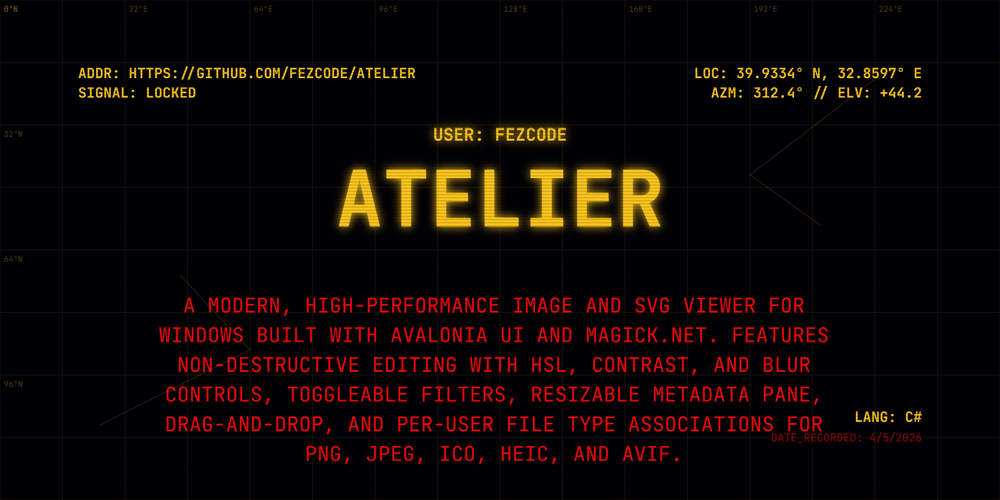

# Atelier



`Atelier` is a high-performance, modern image and SVG viewer built with **Avalonia UI** and **C#**. It provides a buttery-smooth viewing experience with native support for modern formats and advanced vector rendering.

## Features
- **Avalonia UI Core**: High-performance, cross-platform XAML-based UI.
- **Hardware Acceleration**: Uses SkiaSharp for GPU-accelerated rendering.
- **SVG Native Support**: Infinite zoom for vector graphics with high fidelity.
- **HEIC/HEIF Support**: View modern smartphone photos directly via Magick.NET.
- **Fluid Navigation**: Seamless directory browsing and centered zooming.
- **Drag & Drop**: Open any supported file or folder instantly.
- **Minimalist Design**: Clean, dark-themed interface focused on your content.

## Controls
- **Mouse Wheel + Ctrl**: Zoom in/out.
- **Left/Right Arrow**: Previous/Next image in the folder.
- **`F`**: Toggle Fullscreen.
- **Drag & Drop**: Drop any file to view.

## Releases
You can download the latest pre-built binaries from the [Releases](https://github.com/fezcode/Atelier/releases) page.

## Build Requirements
- **.NET 8.0 SDK**

## Building & Running
1. **Clone the repository**:
   ```bash
   git clone https://github.com/fezcode/Atelier.git
   cd Atelier
   ```

2. **Run the application**:
   ```bash
   dotnet run
   ```
